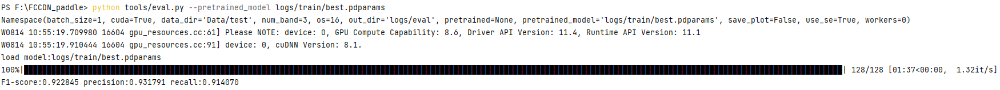

# FCCDN-paddle

## 目录

- [1. 简介]()
- [2. 数据集和复现精度]()
- [3. 准备数据与环境]()
    - [3.1 准备环境]()
    - [3.2 准备数据]()
- [4. 开始使用]()
    - [4.1 模型训练]()
    - [4.2 模型评估]()
- [5. 模型推理部署]()
- [6. 自动化测试脚本]()
- [7. LICENSE]()
- [8. 参考链接与文献]()
- [附录.模型对齐]()

## 1. 简介
FCCDN是一种性能优异的变化检测框架。其主要内容包括一个基于编解码器的**dual encoder-decoder(DED)** 作为骨干网络，一个**nonlocal feature pyramid network(NL-FPN)**作为增强特征提取及融合模块，一个**dense connection-based feature fusion module (DFM)** 用于融合双时态图像特征，并且提出了一种基于类别分割的自监督任务用于提升模型性能。FCCDN具体框架结构如下图所示：


**论文:** [FCCDN: Feature Constraint Network for VHR Image Change Detection](https://arxiv.org/pdf/2105.10860.pdf)

**参考repo:** [FCCDN_pytorch](https://github.com/chenpan0615/FCCDN_pytorch)

在此非常感谢`chenpan0615`等人贡献的[FCCDN_pytorch](https://github.com/chenpan0615/FCCDN_pytorch) ，提高了本repo复现论文的效率。

**aistudio体验教程:** [FCCDN_paddle](https://aistudio.baidu.com/aistudio/projectdetail/4411651)


## 2. 数据集和复现精度

- 数据集大小：共包含train test val三组数据，每组数据包含A B label三个文件夹，解压分割后总大小在5.18G左右
- 数据集下载链接：[LEVIR-CD](https://justchenhao.github.io/LEVIR/)
- 训练权重下载链接：[logs](https://pan.baidu.com/s/1WbiHONiEadeBzJ0cBBbTCA) (提取码：7pfu)
# 复现精度（Comparison to chen et al.）

|                  |    环境(env)     |    F1-score(%)    | precision(%)      |recall(%)          |
| ---------------  | --------------- | -------------- | -------------- | -------------- |
| FCCDN-torch(LEVIR-CD)**(论文)**  | RTX TITAN 24GB  |   92.29   |   93.07        |   91.52        |
| FCCDN-paddle(LEVIR-CD)**(本项目)** |    V100 32GB  |   92.28   |    93.18     |     91.41      |  

**与原论文区别点：**
- 相比于论文采用了albumentations库，本项目使用paddle,numpy,opencv-python对albumentations的数据增强函数进行了迁移。
- 根据论文作者的issue回复，添加了warmup策略，最开始两百步学习率从1e-7上升到初始学习率
- 根据论文作者的issue回复，按照论文中的早停策略训练会出现提前结束的情况，因此添加了每个阶段的保底训练轮次（论文训练轮次的80%），防止过早结束训练,且最终训练轮次未超过论文训练轮次  
论文作者回复如下：  

## 3. 准备数据与环境


### 3.1 准备环境

首先介绍下支持的硬件和框架版本等环境的要求：

- 硬件：GPU显存建议在24G以上
- 框架：
  - PaddlePaddle >= 2.2.0
- 环境配置：
  - 安装GPU版本paddlepaddle:  
  `pip install paddlepaddle-gpu`
  - 如果使用AI-Studio平台则无需安装其他库，直接即可运行
  - 否则请自行查漏补缺，使用的库都为常见库
### 3.2 准备数据

#### 全量数据训练：
  - 下载好 [LEVIR-CD](https://justchenhao.github.io/LEVIR/) 数据集
  - 将其解压到 根目录下的**LEVIR-CD** 文件夹下,文件格式如下所示：
  ```
    │LEVIR-CD
    ├──train(size:1024*1024)
    │  ├── A
    │  ├── B
    │  ├── label
    │     
    ├──val(size:1024*1024)
    │  ├── A
    │  ├── B
    │  ├── label
    │     
    ├──test(size:1024*1024)
    │  ├── A
    │  ├── B
    │  ├── label
  ```
- 运行分割代码:  
`python tools/split_LEVIRCD.py --data_dir LEVIR-CD --out_dir Data`  
 将训练数据集划分为512*512的小块,得到最终数据集
  ```
    │Data
    ├──train(size:512*512)
    │  ├── A
    │  ├── B
    │  ├── label
    │     
    ├──val(size:512*512)
    │  ├── A
    │  ├── B
    │  ├── label
    │     
    ├──test(size:1024*1024)
    │  ├── A
    │  ├── B
    │  ├── label
  ```
####少量数据训练：
  - 无需下载数据集，使用lite_data里的数据即可
  

## 4. 开始使用


### 4.1 模型训练

- 全量数据训练：
  - 首先按照3.2节所述准备好数据
  - 运行指令`python tools/train.py --batch_size 16 --workers 4`
- 少量数据训练：
  - 运行指令`python tools/train.py --batch_size 1 --data_dir lite_data --epochs 5`
- 部分训练日志如下所示：


### 4.2 模型评估

- 全量数据模型评估：`python tools/eval.py --pretrained_model logs/train/best.pdparams`
- 少量数据模型评估：`python tools/eval.py --data_dir lite_data --pretrained_model logs/train/best.pdparams`，部分验证日志如下：  

- 如果想要验证的过程中输出检测结果，需要加入参数`--save_plot True`,验证结果如下：  


## 5. 模型推理部署

- 模型导出：
```
python deploy/export_model.py
```
- 基于导出的模型进行推理：
```
python deploy/infer.py --imgA-path images/demoA.png --imgB-path images/demoB.png --result_savepath images
```
- 模型推理结果如下：  


## 6. 自动化测试脚本
- tipc创建指南请见[tipc创建及基本使用方法。](https://github.com/PaddlePaddle/models/blob/release/2.2/tutorials/tipc/train_infer_python/test_train_infer_python.md)
- 本项目TIPC脚本测试命令详见[Linux GPU/CPU 基础训练推理测试](test_tipc/docs/test_train_inference_python.md)
```bash
#测试环境准备脚本
bash test_tipc/prepare.sh test_tipc/configs/FCCDN/train_infer_python.txt lite_train_lite_infer
```

```bash
#测试训练验证推理一体化脚本
bash test_tipc/test_train_inference_python.sh test_tipc/configs/FCCDN/train_infer_python.txt lite_train_lite_infer
```

输出结果如下，表示命令运行成功。

```bash
 Run successfully with command - python3.7 tools/train.py --data_dir lite_data --val_epoch 1 --output=./log/FCCDN/lite_train_lite_infer/norm_train_gpus_0 --epochs=2   --batch_size=1!  
......
 Run successfully with command - python3.7 tools/eval.py --data_dir lite_data/test --pretrained=./log/FCCDN/lite_train_lite_infer/norm_train_gpus_0/best.pdparams!  
......
 Run successfully with command - python3.7 deploy/export_model.py  --pretrained=./log/FCCDN/lite_train_lite_infer/norm_train_gpus_0/best.pdparams --save-inference-dir=./log/FCCDN/lite_train_lite_infer/norm_train_gpus_0!  
......
 Run successfully with command - python3.7 deploy/infer.py --imgA-path images/demoA.png --imgB-path images/demoB.png --use-gpu=True --model-dir=./log/FCCDN/lite_train_lite_infer/norm_train_gpus_0 --batch-size=1   --benchmark=False > ./log/FCCDN/lite_train_lite_infer/python_infer_gpu_batchsize_1.log 2>&1 !  
```

## 7. LICENSE

本项目的发布受[Apache 2.0 license](./LICENSE)许可认证。

## 8. 参考链接与文献
**参考论文:** [FCCDN: Feature Constraint Network for VHR Image Change Detection](https://arxiv.org/pdf/2105.10860.pdf)

**参考repo:** [FCCDN_pytorch](https://github.com/chenpan0615/FCCDN_pytorch)


## 附录.模型对齐
### 前向对齐
统一虚拟数据，分别送入pytorch和paddle搭建的网络进行前向推理，输出结果及平均差值如下图所示：  
  
最终误差为**3E-4**量级，经过排查原因出在pytorch和paddle的**Conv2D**模块的差异上，单一层卷积差异就有**7E-5**量级，几十层卷积层叠加起来，这个误差量级也就比较正常了。经询问技术老师，他也认为这个对齐精度也可以接受。  
Conv2D模块误差测试如下，只要卷积前后通道数发生改变，有填充行为，填充模式为零填充，误差就会上升到**7E-5**：  
- **正常卷积：**  
  
- **不正常卷积：**  

### 反向对齐
统一虚拟数据，分别送入pytorch和paddle搭建的损失函数中进行损失计算，输出结果及平均差值如下图所示：  
  
最终误差近似为0

